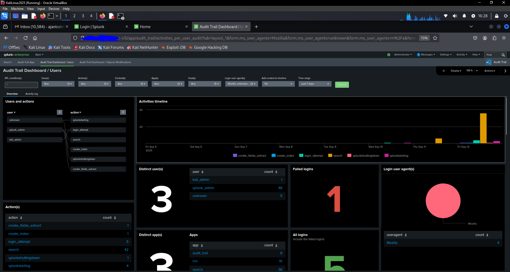
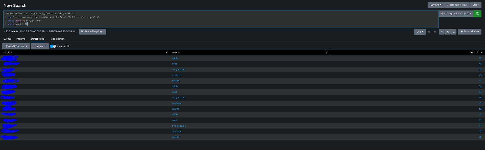
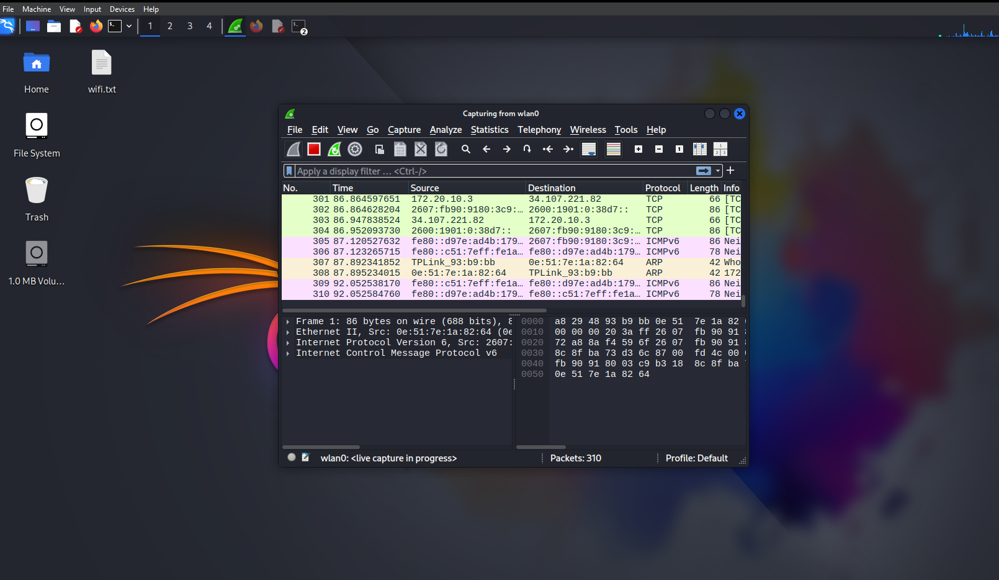

# About Me

Hi, I’m Ajani Cole, a Computer Science student at Florida International University with a strong interest in cybersecurity. I’m passionate about protecting systems and data through network security, penetration testing, and system hardening.

I’ve worked on projects that include vulnerability assessments in virtual labs, analyzing network traffic with Wireshark, and testing password security. These experiences have helped me build a solid foundation in identifying risks, applying mitigation strategies, and thinking critically about how to secure modern systems.

Beyond my technical skills, I enjoy problem-solving and the continuous learning that come with this field. Cybersecurity is constantly evolving, and I’m motivated to stay ahead by experimenting with new tools, studying real-world threats, and expanding my knowledge through hands-on projects.


## Skills and Tools
<dt>Languages and Scripting:</dt>
<dd>Python, C and Bash.</dd>
<dt>Familiar Security Tools:</dt>
<dd>ClamAV, Hashcat, John the Ripper, Nmap, Snort, Wazuh and Wireshark.</dd>
 
 


# Projects

### SIEM Deployment and Attack Simulation (Splunk on VM)


For this project, I deployed a Splunk SIEM in a virtual machine environment and configured forwarder agents to collect logs from different systems. Once the SIEM was operational, I simulated attacks (such as brute force login attempts and port scans) to generate realistic security events.



I wrote detection queries (in Splunk SPL) to analyze the collected logs, detect malicious activity, and create custom dashboards to visualize security alerts.

```py
#Brute Force Login Attempts (failed logins by same user/IP):
index=security sourcetype=auth 
action="failure" 
| stats count by src, user 
| where count > 10

```
```py
#Successful Login After Failures (possible brute force success):
index=security sourcetype=auth 
| transaction user maxspan=5m 
| search failure failure failure success
```

```py
#Port Scanning Activity (many ports hit by same IP):
index=network sourcetype=firewall 
| stats dc(dest_port) as unique_ports by src_ip 
| where unique_ports > 20
```

This project demonstrated how SIEM solutions help security analysts monitor environments, identify threats, and respond to incidents in real time. It also strengthened my skills in log collection, query writing, and attack detection.

Key Tools: Splunk, Universal Forwarder Agents, VirtualBox/VMware, Kali Linux, Windows/Linux log sources
Focus Areas: SIEM setup, log collection, attack simulation, KQL queries, security monitoring


### Network Traffic Analysis with Wireshark

For this project, I captured and analyzed network traffic to identify suspicious activity. Using Wireshark, I monitored packets, tracked anomalies, and documented findings such as unusual patterns that could indicate potential attacks.

This project reinforced my understanding of how network packets reveal system behavior and taught me how to spot possible intrusions through careful analysis.

Key Tools: Wireshark
Focus Areas: Packet capture, anomaly detection, intrusion analysis

### Password Cracking & Security

In this project, I tested the strength of different passwords using Hashcat and John the Ripper. By demonstrating how quickly weak passwords can be cracked, I emphasized the importance of strong password practices and secure hashing methods.

I concluded the project by developing guidelines for creating stronger passwords and implementing security policies that help organizations protect user credentials.

Key Tools: Hashcat, John the Ripper, Linux CLI
Focus Areas: Password security, hashing, security policies

____________________________________________

Text can be **bold**, _italic_, ~~strikethrough~~ or `keyword`.

[Link to another page](./another-page.html).


There should be whitespace between paragraphs. We recommend including a README, or a file with information about your project.

> This is a blockquote following a header.
>
> When something is important enough, you do it even if the odds are not in your favor.

### Header 3

```js
// Javascript code with syntax highlighting.
var fun = function lang(l) {
  dateformat.i18n = require('./lang/' + l)
  return true;
}
```

```ruby
# Ruby code with syntax highlighting
GitHubPages::Dependencies.gems.each do |gem, version|
  s.add_dependency(gem, "= #{version}")
end
```

#### Header 4

*   This is an unordered list following a header.
*   This is an unordered list following a header.
*   This is an unordered list following a header.

##### Header 5

1.  This is an ordered list following a header.
2.  This is an ordered list following a header.
3.  This is an ordered list following a header.

###### Header 6

| head1        | head two          | three |
|:-------------|:------------------|:------|
| ok           | good swedish fish | nice  |
| out of stock | good and plenty   | nice  |
| ok           | good `oreos`      | hmm   |
| ok           | good `zoute` drop | yumm  |

### There's a horizontal rule below this.

* * *

### Here is an unordered list:

*   Item foo
*   Item bar
*   Item baz
*   Item zip

### And an ordered list:

1.  Item one
1.  Item two
1.  Item three
1.  Item four

### And a nested list:

- level 1 item
  - level 2 item
  - level 2 item
    - level 3 item
    - level 3 item
- level 1 item
  - level 2 item
  - level 2 item
  - level 2 item
- level 1 item
  - level 2 item
  - level 2 item
- level 1 item

### Small image


### Large image


### Definition lists can be used with HTML syntax.

<dl>
<dt>Name</dt>
<dd>Godzilla</dd>
<dt>Born</dt>
<dd>1952</dd>
<dt>Birthplace</dt>
<dd>Japan</dd>
<dt>Color</dt>
<dd>Green</dd>
</dl>

```
Long, single-line code blocks should not wrap. They should horizontally scroll if they are too long. This line should be long enough to demonstrate this.
```

```
The final element.
```
